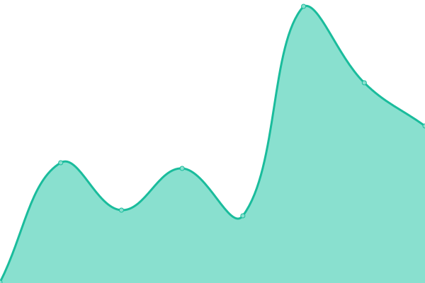

# [📈 Live Status](https://uptime.watchtower2.com): <!--live status--> **🟧 Partial outage**

This repository contains the open-source uptime monitor and status page for [Climate Pros](https://www.climatepros.com), powered by [Upptime](https://github.com/upptime/upptime).

We use [Issues](https://github.com/Climate-Pros/WatchTower.Monitoring.UpTime/issues) as incident reports, [Actions](https://github.com/Climate-Pros/WatchTower.Monitoring.UpTime/actions) as uptime monitors, and [Pages](https://uptime.watchtower2.com) for the status page.

<!--start: status pages-->
<!-- This summary is generated by Upptime (https://github.com/upptime/upptime) -->
<!-- Do not edit this manually, your changes will be overwritten -->
<!-- prettier-ignore -->
| URL | Status | History | Response Time | Uptime |
| --- | ------ | ------- | ------------- | ------ |
|  [Development >> API >> VNext](https://vnext-api.dev.watchtower2.com) | 🟩 Up | [development-api-v-next.yml](https://github.com/Climate-Pros/WatchTower.Monitoring.UpTime/commits/HEAD/history/development-api-v-next.yml) | 

 446ms
     
 | 

<a href="https://uptime.watchtower2.com/history/development-api-v-next">98.84%</a>
    

|  [Development >> API >> Intelligence](https://intelligence-api.dev.watchtower2.com) | 🟥 Down | [development-api-intelligence.yml](https://github.com/Climate-Pros/WatchTower.Monitoring.UpTime/commits/HEAD/history/development-api-intelligence.yml) | 

 475ms
     
 | 

<a href="https://uptime.watchtower2.com/history/development-api-intelligence">89.86%</a>
    

|  [Development >> API >> Legacy](https://legacy-api.dev.watchtower2.com) | 🟥 Down | [development-api-legacy.yml](https://github.com/Climate-Pros/WatchTower.Monitoring.UpTime/commits/HEAD/history/development-api-legacy.yml) | 

 239ms
     
 | 

<a href="https://uptime.watchtower2.com/history/development-api-legacy">88.24%</a>
    

|  [Development >> API >> Smtp Gateway](https://smtp-gateway-api.dev.watchtower2.com/) | 🟥 Down | [development-api-smtp-gateway.yml](https://github.com/Climate-Pros/WatchTower.Monitoring.UpTime/commits/HEAD/history/development-api-smtp-gateway.yml) | 

 3756ms
     
 | 

<a href="https://uptime.watchtower2.com/history/development-api-smtp-gateway">88.24%</a>
    

|  [Staging >> API >> VNext](https://vnext-api.stg.watchtower2.com) | 🟩 Up | [staging-api-v-next.yml](https://github.com/Climate-Pros/WatchTower.Monitoring.UpTime/commits/HEAD/history/staging-api-v-next.yml) | 

 2010ms
     
 | 

<a href="https://uptime.watchtower2.com/history/staging-api-v-next">100.00%</a>
    

|  [Staging >> API >> Intelligence](https://intelligence-api.stg.watchtower2.com) | 🟩 Up | [staging-api-intelligence.yml](https://github.com/Climate-Pros/WatchTower.Monitoring.UpTime/commits/HEAD/history/staging-api-intelligence.yml) | 

 220ms
     
 | 

<a href="https://uptime.watchtower2.com/history/staging-api-intelligence">100.00%</a>
    

|  [Staging >> API >> Legacy](https://legacy-api.stg.watchtower2.com) | 🟩 Up | [staging-api-legacy.yml](https://github.com/Climate-Pros/WatchTower.Monitoring.UpTime/commits/HEAD/history/staging-api-legacy.yml) | 

 213ms
     
 | 

<a href="https://uptime.watchtower2.com/history/staging-api-legacy">100.00%</a>
    

|  [Staging >> API >> Smtp Gateway](https://smtp-gateway-api.stg.watchtower2.com/) | 🟩 Up | [staging-api-smtp-gateway.yml](https://github.com/Climate-Pros/WatchTower.Monitoring.UpTime/commits/HEAD/history/staging-api-smtp-gateway.yml) | 

 2387ms
     
 | 

<a href="https://uptime.watchtower2.com/history/staging-api-smtp-gateway">100.00%</a>
    

|  [Production >> API >> VNext](https://vnext-api.prd.watchtower2.com) | 🟩 Up | [production-api-v-next.yml](https://github.com/Climate-Pros/WatchTower.Monitoring.UpTime/commits/HEAD/history/production-api-v-next.yml) | 

 200ms
     
 | 

<a href="https://uptime.watchtower2.com/history/production-api-v-next">100.00%</a>
    

|  [Production >> API >> Intelligence](https://intelligence-api.prd.watchtower2.com) | 🟩 Up | [production-api-intelligence.yml](https://github.com/Climate-Pros/WatchTower.Monitoring.UpTime/commits/HEAD/history/production-api-intelligence.yml) | 

 221ms
     
 | 

<a href="https://uptime.watchtower2.com/history/production-api-intelligence">100.00%</a>
    

|  [Production >> API >> Legacy](https://legacy-api.prd.watchtower2.com) | 🟩 Up | [production-api-legacy.yml](https://github.com/Climate-Pros/WatchTower.Monitoring.UpTime/commits/HEAD/history/production-api-legacy.yml) | 

 3427ms
     
 | 

<a href="https://uptime.watchtower2.com/history/production-api-legacy">100.00%</a>
    

|  [Production >> API >> Smtp Gateway](https://smtp-gateway-api.prd.watchtower2.com/) | 🟩 Up | [production-api-smtp-gateway.yml](https://github.com/Climate-Pros/WatchTower.Monitoring.UpTime/commits/HEAD/history/production-api-smtp-gateway.yml) | 

 1770ms
     
 | 

<a href="https://uptime.watchtower2.com/history/production-api-smtp-gateway">100.00%</a>
    

<!--end: status pages-->

[**Visit our status website →**](https://uptime.watchtower2.com)

## 📄 License

- Powered by: [Upptime](https://github.com/upptime/upptime)
- Code: [MIT](./LICENSE) © [Climate Pros](https://www.climatepros.com)
- Data in the `./history` directory: [Open Database License](https://opendatacommons.org/licenses/odbl/1-0/)
