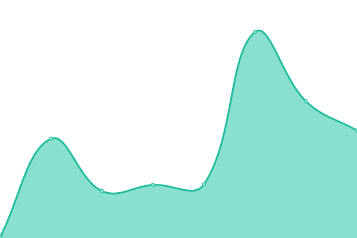

# [📈 Live Status](https://uptime.watchtower2.com): <!--live status--> **🟧 Partial outage**

This repository contains the open-source uptime monitor and status page for [Climate Pros](https://www.climatepros.com), powered by [Upptime](https://github.com/upptime/upptime).

We use [Issues](https://github.com/Climate-Pros/WatchTower.Monitoring.UpTime/issues) as incident reports, [Actions](https://github.com/Climate-Pros/WatchTower.Monitoring.UpTime/actions) as uptime monitors, and [Pages](https://uptime.watchtower2.com) for the status page.

<!--start: status pages-->
<!-- This summary is generated by Upptime (https://github.com/upptime/upptime) -->
<!-- Do not edit this manually, your changes will be overwritten -->
<!-- prettier-ignore -->
| URL | Status | History | Response Time | Uptime |
| --- | ------ | ------- | ------------- | ------ |
|  [Development >> API >> VNext](https://vnext-api.dev.watchtower2.com) | 🟥 Down | [development-api-v-next.yml](https://github.com/Climate-Pros/WatchTower.Monitoring.UpTime/commits/HEAD/history/development-api-v-next.yml) | 

 243ms
     
 | 

<a href="https://uptime.watchtower2.com/history/development-api-v-next">99.99%</a>
    

|  [Development >> API >> Intelligence](https://intelligence-api.dev.watchtower2.com) | 🟥 Down | [development-api-intelligence.yml](https://github.com/Climate-Pros/WatchTower.Monitoring.UpTime/commits/HEAD/history/development-api-intelligence.yml) | 

 249ms
     
 | 

<a href="https://uptime.watchtower2.com/history/development-api-intelligence">99.99%</a>
    

|  [Development >> API >> Legacy](https://legacy-api.dev.watchtower2.com) | 🟥 Down | [development-api-legacy.yml](https://github.com/Climate-Pros/WatchTower.Monitoring.UpTime/commits/HEAD/history/development-api-legacy.yml) | 

 277ms
     
 | 

<a href="https://uptime.watchtower2.com/history/development-api-legacy">99.99%</a>
    

|  [Development >> API >> Smtp Gateway](https://smtp-gateway.dev.watchtower2.com/) | 🟥 Down | [development-api-smtp-gateway.yml](https://github.com/Climate-Pros/WatchTower.Monitoring.UpTime/commits/HEAD/history/development-api-smtp-gateway.yml) | 

 253ms
     
 | 

<a href="https://uptime.watchtower2.com/history/development-api-smtp-gateway">70.98%</a>
    

|  [Development >> Hosted >> Health Checks](https://healthchecks.dev.watchtower2.com/) | 🟩 Up | [development-hosted-health-checks.yml](https://github.com/Climate-Pros/WatchTower.Monitoring.UpTime/commits/HEAD/history/development-hosted-health-checks.yml) | 

 274ms
     
 | 

<a href="https://uptime.watchtower2.com/history/development-hosted-health-checks">100.00%</a>
    

|  [Development >> Hosted >> Apprise](https://apprise.dev.watchtower2.com/) | 🟩 Up | [development-hosted-apprise.yml](https://github.com/Climate-Pros/WatchTower.Monitoring.UpTime/commits/HEAD/history/development-hosted-apprise.yml) | 

 264ms
     
 | 

<a href="https://uptime.watchtower2.com/history/development-hosted-apprise">100.00%</a>
    

|  [Development >> Hosted >> Exceptionless](https://exceptionless.dev.watchtower2.com/v) | 🟩 Up | [development-hosted-exceptionless.yml](https://github.com/Climate-Pros/WatchTower.Monitoring.UpTime/commits/HEAD/history/development-hosted-exceptionless.yml) | 

 221ms
     
 | 

<a href="https://uptime.watchtower2.com/history/development-hosted-exceptionless">100.00%</a>
    

|  [Staging >> API >> VNext](https://vnext-api.stg.watchtower2.com) | 🟩 Up | [staging-api-v-next.yml](https://github.com/Climate-Pros/WatchTower.Monitoring.UpTime/commits/HEAD/history/staging-api-v-next.yml) | 

 223ms
     
 | 

<a href="https://uptime.watchtower2.com/history/staging-api-v-next">100.00%</a>
    

|  [Staging >> API >> Intelligence](https://intelligence-api.stg.watchtower2.com) | 🟩 Up | [staging-api-intelligence.yml](https://github.com/Climate-Pros/WatchTower.Monitoring.UpTime/commits/HEAD/history/staging-api-intelligence.yml) | 

 218ms
     
 | 

<a href="https://uptime.watchtower2.com/history/staging-api-intelligence">100.00%</a>
    

|  [Staging >> API >> Legacy](https://legacy-api.stg.watchtower2.com) | 🟩 Up | [staging-api-legacy.yml](https://github.com/Climate-Pros/WatchTower.Monitoring.UpTime/commits/HEAD/history/staging-api-legacy.yml) | 

 228ms
     
 | 

<a href="https://uptime.watchtower2.com/history/staging-api-legacy">100.00%</a>
    

|  [Staging >> API >> Smtp Gateway](https://smtp-gateway.stg.watchtower2.com/) | 🟩 Up | [staging-api-smtp-gateway.yml](https://github.com/Climate-Pros/WatchTower.Monitoring.UpTime/commits/HEAD/history/staging-api-smtp-gateway.yml) | 

 248ms
     
 | 

<a href="https://uptime.watchtower2.com/history/staging-api-smtp-gateway">100.00%</a>
    

|  [Staging >> Hosted >> Health Checks](https://healthchecks.stg.watchtower2.com/) | 🟩 Up | [staging-hosted-health-checks.yml](https://github.com/Climate-Pros/WatchTower.Monitoring.UpTime/commits/HEAD/history/staging-hosted-health-checks.yml) | 

 264ms
     
 | 

<a href="https://uptime.watchtower2.com/history/staging-hosted-health-checks">100.00%</a>
    

|  [Staging >> Hosted >> Apprise](https://apprise.stg.watchtower2.com/) | 🟩 Up | [staging-hosted-apprise.yml](https://github.com/Climate-Pros/WatchTower.Monitoring.UpTime/commits/HEAD/history/staging-hosted-apprise.yml) | 

 255ms
     
 | 

<a href="https://uptime.watchtower2.com/history/staging-hosted-apprise">100.00%</a>
    

|  [Staging >> Hosted >> Exceptionless](https://exceptionless.stg.watchtower2.com/) | 🟩 Up | [staging-hosted-exceptionless.yml](https://github.com/Climate-Pros/WatchTower.Monitoring.UpTime/commits/HEAD/history/staging-hosted-exceptionless.yml) | 

 205ms
     
 | 

<a href="https://uptime.watchtower2.com/history/staging-hosted-exceptionless">100.00%</a>
    

|  [Production >> API >> VNext](https://vnext-api.prd.watchtower2.com) | 🟩 Up | [production-api-v-next.yml](https://github.com/Climate-Pros/WatchTower.Monitoring.UpTime/commits/HEAD/history/production-api-v-next.yml) | 

 223ms
     
 | 

<a href="https://uptime.watchtower2.com/history/production-api-v-next">100.00%</a>
    

|  [Production >> API >> Intelligence](https://intelligence-api.prd.watchtower2.com) | 🟩 Up | [production-api-intelligence.yml](https://github.com/Climate-Pros/WatchTower.Monitoring.UpTime/commits/HEAD/history/production-api-intelligence.yml) | 

 203ms
     
 | 

<a href="https://uptime.watchtower2.com/history/production-api-intelligence">100.00%</a>
    

|  [Production >> API >> Legacy](https://legacy-api.prd.watchtower2.com) | 🟩 Up | [production-api-legacy.yml](https://github.com/Climate-Pros/WatchTower.Monitoring.UpTime/commits/HEAD/history/production-api-legacy.yml) | 

 211ms
     
 | 

<a href="https://uptime.watchtower2.com/history/production-api-legacy">100.00%</a>
    

|  [Production >> API >> Smtp Gateway](https://smtp-gateway.prd.watchtower2.com/) | 🟩 Up | [production-api-smtp-gateway.yml](https://github.com/Climate-Pros/WatchTower.Monitoring.UpTime/commits/HEAD/history/production-api-smtp-gateway.yml) | 

 250ms
     
 | 

<a href="https://uptime.watchtower2.com/history/production-api-smtp-gateway">100.00%</a>
    

|  [Production >> Hosted >> Health Checks](https://healthchecks.prd.watchtower2.com/) | 🟩 Up | [production-hosted-health-checks.yml](https://github.com/Climate-Pros/WatchTower.Monitoring.UpTime/commits/HEAD/history/production-hosted-health-checks.yml) | 

 266ms
     
 | 

<a href="https://uptime.watchtower2.com/history/production-hosted-health-checks">100.00%</a>
    

|  [Production >> Hosted >> Apprise](https://apprise.prd.watchtower2.com/) | 🟩 Up | [production-hosted-apprise.yml](https://github.com/Climate-Pros/WatchTower.Monitoring.UpTime/commits/HEAD/history/production-hosted-apprise.yml) | 

 249ms
     
 | 

<a href="https://uptime.watchtower2.com/history/production-hosted-apprise">100.00%</a>
    

|  [Production >> Hosted >> Exceptionless](https://exceptionless.prd.watchtower2.com/) | 🟩 Up | [production-hosted-exceptionless.yml](https://github.com/Climate-Pros/WatchTower.Monitoring.UpTime/commits/HEAD/history/production-hosted-exceptionless.yml) | 

 190ms
     
 | 

<a href="https://uptime.watchtower2.com/history/production-hosted-exceptionless">100.00%</a>
    

<!--end: status pages-->

[**Visit our status website →**](https://uptime.watchtower2.com)

## 📄 License

- Powered by: [Upptime](https://github.com/upptime/upptime)
- Code: [MIT](./LICENSE) © [Climate Pros](https://www.climatepros.com)
- Data in the `./history` directory: [Open Database License](https://opendatacommons.org/licenses/odbl/1-0/)
